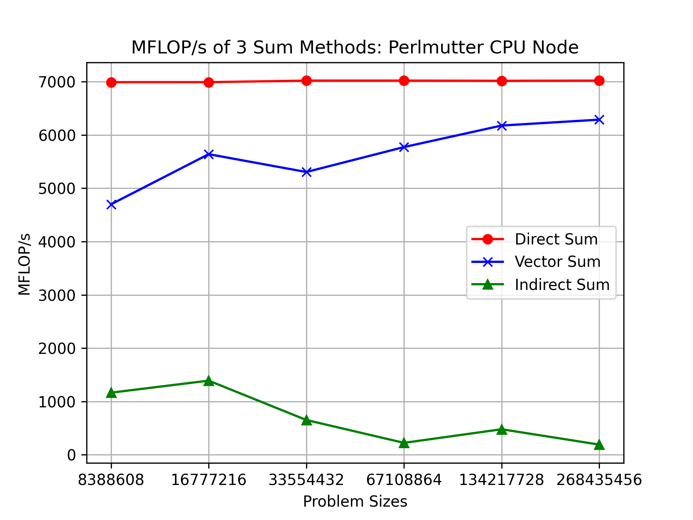
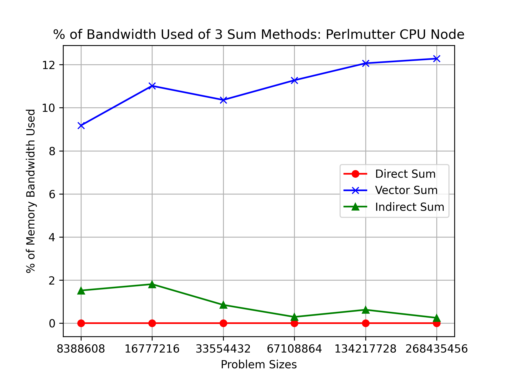
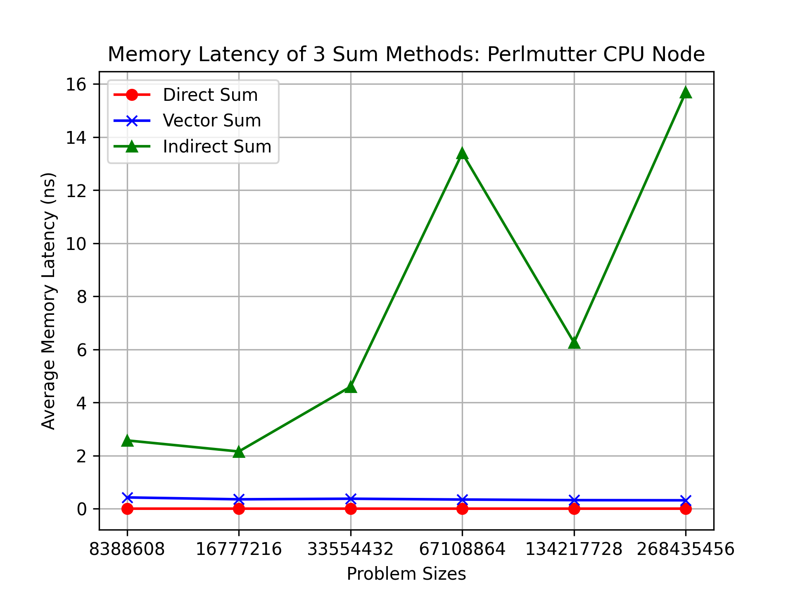

# Overview
3 different codes for calculating a sum are ran on a CPU node on the NERSC Perlmutter; the runtimes are recorded for analysis.  
Using the runtime data, some derived performance metrics are computed – MFLOP/s, % memory bandwidth utilized, memory latency – and charts of this data are created.

### Assumptions
There is no cost associated with accessing, incrementing, and testing the loop index variable.  
There is no memory access cost for accumulator variables; assuming that they live in a register.  
Only the contents of the loop performing the sum is included in my analysis.  

# Formulas
`MFLOP/s = (Operations/1e+6)/Runtime`  
`% of Memory Bandwidth Utilized = (((Bytes/1e+9)/Runtime)/Capacity in GB/s)*100`  
`Average Memory Latency = (Runtime/Number of Memory Accesses)*1e+9`  

The `int64_t` type used in my code is an 8 byte signed integer.

The Perlmutter has 3072 CPU nodes with 2x AMD EPYC 7763 (Milan) CPUs each; each CPU has a total of 64 cores. The memory bandwidth per CPU is 204.8 GB/s. The code only uses one core (since the code has no multi-threading or parallelism), so the memory bandwidth capacity is 204.8 GB/s divded by 64 (the number of cores) or 3.2 GB/s. However, plugging 3.2 into the Memory Bandwidth formula gave me percentage values over 100%, so I figured I had the capacity wrong and used 204.8 instead.

# Direct Sum
Arithmetic Operations = 1N  
Memory Operations = 0N  
Total Operations = 1N  

### MFLOP/s
```
(8388608/1000000)/0.00120   = 6990.506667 MFLOP/s
(16777216/1000000)/0.00240  = 6990.506667 MFLOP/s
(33554432/1000000)/0.00478  = 7019.755649 MFLOP/s
(67108864/1000000)/0.00956  = 7019.755649 MFLOP/s
(134217728/1000000)/0.01913 = 7016.086147 MFLOP/s
(268435456/1000000)/0.03824 = 7019.755649 MFLOP/s
```
### % of Memory Bandwidth Utilized
```
(((0/1000000000)/0.00120)/204.8)*100 = 0 %
(((0/1000000000)/0.00240)/204.8)*100 = 0 %
(((0/1000000000)/0.00478)/204.8)*100 = 0 %
(((0/1000000000)/0.00956)/204.8)*100 = 0 %
(((0/1000000000)/0.01913)/204.8)*100 = 0 %
(((0/1000000000)/0.03824)/204.8)*100 = 0 %
```
### Average Memory Latency
```
(0.00120/0)*1000000000 = 0 ns
(0.00240/0)*1000000000 = 0 ns
(0.00478/0)*1000000000 = 0 ns
(0.00956/0)*1000000000 = 0 ns
(0.01913/0)*1000000000 = 0 ns
(0.03824/0)*1000000000 = 0 ns
```

# Vector Sum
Arithmetic Operations = 1N  
Memory Operations = 1N  
Total Operations = 2N  

### MFLOP/s
```
(16777216/1000000)/0.00357  = 4699.500280 MFLOP/s
(33554432/1000000)/0.00595  = 5639.400336 MFLOP/s
(67108864/1000000)/0.01265  = 5305.048538 MFLOP/s
(134217728/1000000)/0.02325 = 5772.805505 MFLOP/s
(268435456/1000000)/0.04346 = 6176.609664 MFLOP/s
(536870912/1000000)/0.08539 = 6287.280853 MFLOP/s
```
### % of Memory Bandwidth Utilized
```
(((67108864/1000000000)/0.00357)/204.8)*100   = 9.178711485 %
(((134217728/1000000000)/0.00595)/204.8)*100  = 11.01445378 %
(((268435456/1000000000)/0.01265)/204.8)*100  = 10.36142292 %
(((536870912/1000000000)/0.02325)/204.8)*100  = 11.27501075 %
(((1073741824/1000000000)/0.04346)/204.8)*100 = 12.06369075 %
(((2147483648/1000000000)/0.08539)/204.8)*100 = 12.27984542 %
```
### Average Memory Latency
```
(0.00357/8388608)*1000000000   = 0.42557716369 ns
(0.00595/16777216)*1000000000  = 0.35464763641 ns
(0.01265/33554432)*1000000000  = 0.37699937820 ns
(0.02325/67108864)*1000000000  = 0.34645199775 ns
(0.04346/134217728)*1000000000 = 0.32380223274 ns
(0.08539/268435456)*1000000000 = 0.31810253858 ns
```

# Indirect Sum
Arithmetic Operations = 1N  
Memory Operations = 1N  
Assignment Operations = 1N  
Total Operations = 3N  

### MFLOP/s
```
(25165824/1000000)/0.02159  = 1165.624085 MFLOP/s
(50331648/1000000)/0.03618  = 1391.145605 MFLOP/s
(100663296/1000000)/0.15424 = 652.6406639 MFLOP/s
(201326592/1000000)/0.89918 = 223.9002113 MFLOP/s
(402653184/1000000)/0.84035 = 479.1493830 MFLOP/s
(805306368/1000000)/4.21193 = 191.1965223 MFLOP/s
```
### % of Memory Bandwidth Utilized
```
(((67108864/1000000000)/0.02159)/204.8)*100   = 1.5177396940 %
(((134217728/1000000000)/0.03618)/204.8)*100  = 1.8113875070 %
(((268435456/1000000000)/0.15424)/204.8)*100  = 0.8497925311 %
(((536870912/1000000000)/0.89918)/204.8)*100  = 0.2915367335 %
(((1073741824/1000000000)/0.84035)/204.8)*100 = 0.6238924258 %
(((2147483648/1000000000)/4.21193)/204.8)*100 = 0.248953805  %
```
### Average Memory Latency
```
(0.02159/8388608)*1000000000   = 2.57372856140 ns
(0.03618/16777216)*1000000000  = 2.15649604797 ns
(0.15424/33554432)*1000000000  = 4.59671020508 ns
(0.89918/67108864)*1000000000  = 13.3988261223 ns
(0.84035/134217728)*1000000000 = 6.26109540462 ns
(4.21193/268435456)*1000000000 = 15.6906619668 ns
```

# Charts




# Conclusions
Memory operations are the most expensive type of operation, and indirect sum is conducting the largest number of more expensive operations. Technically, vector sum and indirect sum are doing the same amount of memory operations, but indirect sum has more operations overall, making it the most expensive.

The direct sum has the highest computational rate, or MFLOP/s. This is because it has the least amount of memory accesses, meaning that it has the least amount of downtime between floating-point operations. This results in a lesser overall time and greater floating-point operations per second.

Vector sum also has a higher level of memory bandwidth utilization and a lower level of memory latency as the memory accesses have greater spatial locality compared to indirect sum. In indirect sum, the memory access indexes are random, the chance of the next index being in the cache is significantly lower. This means that data has to be moved from memory to cache more often, increasing its latency. Vector sum on the other hand, has its memory accesses "sorted", as in the next access is right next to the one we are accessing right now. This means there is less downtime as data is moved around, leading to a higher amount of bandwidth used because more memory accesses are able to take place in a shorter amount of time, and a lower memory latency because the amount of times data has to be moved from memory to cache is lower due to multi-word cache blocks.